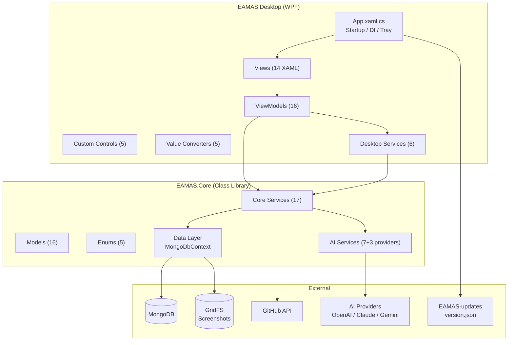
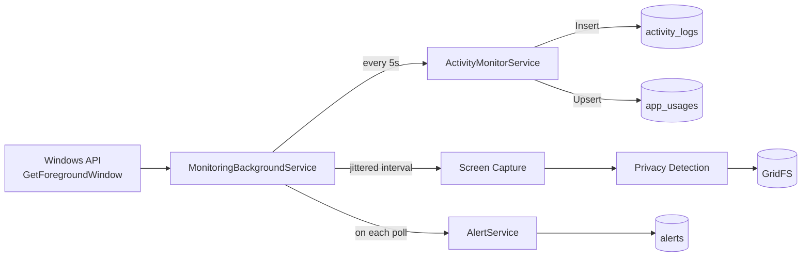
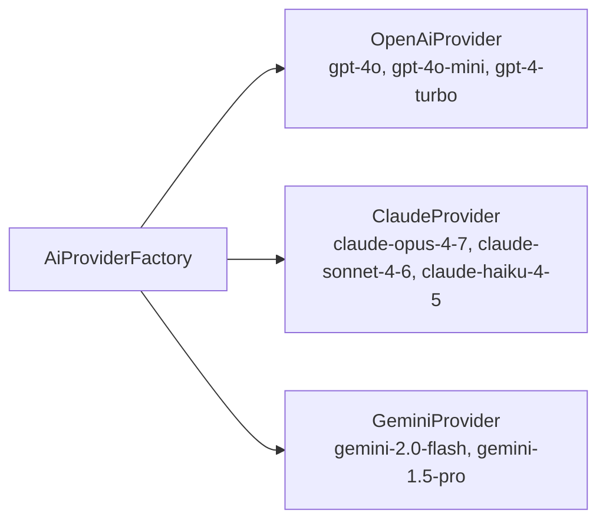
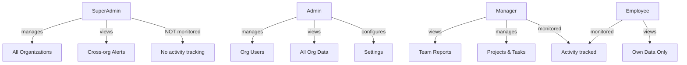
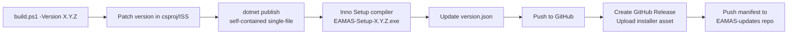

# EAMAS — Complete Codebase Analysis

> **Employee Activity Monitoring & Analytics System**
> Version: **1.2.1** · Stack: **C# / .NET 8 / WPF / MongoDB** · Architecture: **MVVM**

---

## 1. High-Level Architecture

---

## 2. Solution Structure

| Project | Target | Purpose | Dependencies |
|---------|--------|---------|-------------|
| [EAMAS.Core](file:///e:/Employee%20Activity%20Monitoring%20&%20Analytics%20System%20(EAMAS)/src/EAMAS.Core/EAMAS.Core.csproj) | `net8.0` | Domain models, data access, services, AI | MongoDB.Driver 2.30, GridFS, System.Net.Http.Json |
| [EAMAS.Desktop](file:///e:/Employee%20Activity%20Monitoring%20&%20Analytics%20System%20(EAMAS)/src/EAMAS.Desktop/EAMAS.Desktop.csproj) | `net8.0-windows` | WPF application, UI, Windows integration | EAMAS.Core, ClosedXML, QuestPDF, System.Drawing.Common |
| [EAMAS.SetupBootstrapper](file:///e:/Employee%20Activity%20Monitoring%20&%20Analytics%20System%20(EAMAS)/src/EAMAS.SetupBootstrapper/Program.cs) | `net8.0-windows` | Installer bootstrapper | — |

---

## 3. Data Layer

### MongoDB Collections (15 total)

| Collection | Model | Key Fields | Indexes |
|------------|-------|------------|---------|
| `organizations` | [Organization](file:///e:/Employee%20Activity%20Monitoring%20&%20Analytics%20System%20(EAMAS)/src/EAMAS.Core/Models/Organization.cs) | Code (unique), Name, IsActive | Code (unique) |
| `users` | [User](file:///e:/Employee%20Activity%20Monitoring%20&%20Analytics%20System%20(EAMAS)/src/EAMAS.Core/Models/User.cs) | OrgId+Username (unique), Role, Session | OrgId+Username (unique compound) |
| `activity_logs` | [ActivityLog](file:///e:/Employee%20Activity%20Monitoring%20&%20Analytics%20System%20(EAMAS)/src/EAMAS.Core/Models/ActivityLog.cs) | OrgId, UserId, StartTime, ProcessName, IsIdle | OrgId+UserId+StartTime |
| `app_usages` | [AppUsage](file:///e:/Employee%20Activity%20Monitoring%20&%20Analytics%20System%20(EAMAS)/src/EAMAS.Core/Models/AppUsage.cs) | OrgId, UserId, App, RecordedAt, DurationTicks | OrgId+UserId+RecordedAt |
| `screenshot_records` | [ScreenshotRecord](file:///e:/Employee%20Activity%20Monitoring%20&%20Analytics%20System%20(EAMAS)/src/EAMAS.Core/Models/ScreenshotRecord.cs) | OrgId, UserId, TakenAt, GridFS ref, Thumbnail | OrgId+UserId+TakenAt |
| `alerts` | [Alert](file:///e:/Employee%20Activity%20Monitoring%20&%20Analytics%20System%20(EAMAS)/src/EAMAS.Core/Models/Alert.cs) | OrgId, UserId, AlertType, IsRead | OrgId+UserId+CreatedAt |
| `app_category_rules` | [AppCategoryRule](file:///e:/Employee%20Activity%20Monitoring%20&%20Analytics%20System%20(EAMAS)/src/EAMAS.Core/Models/AppCategoryRule.cs) | OrgId, Keyword, Category, Priority | OrgId+Priority (desc) |
| `system_settings` | [SystemSettings](file:///e:/Employee%20Activity%20Monitoring%20&%20Analytics%20System%20(EAMAS)/src/EAMAS.Core/Models/SystemSettings.cs) | OrgId (unique), monitoring/alert configs | OrgId (unique) |
| `audit_logs` | [AuditLog](file:///e:/Employee%20Activity%20Monitoring%20&%20Analytics%20System%20(EAMAS)/src/EAMAS.Core/Models/AuditLog.cs) | OrgId, ActorName, Action, Timestamp | OrgId+Timestamp (desc) |
| `projects` | [Project](file:///e:/Employee%20Activity%20Monitoring%20&%20Analytics%20System%20(EAMAS)/src/EAMAS.Core/Models/Project.cs) | OrgId, GitHub config, AI config, PRD | OrgId |
| `tasks` | [ProjectTask](file:///e:/Employee%20Activity%20Monitoring%20&%20Analytics%20System%20(EAMAS)/src/EAMAS.Core/Models/ProjectTask.cs) | OrgId, ProjectId, SprintId, Kanban status | 3 compound indexes |
| `sprints` | [Sprint](file:///e:/Employee%20Activity%20Monitoring%20&%20Analytics%20System%20(EAMAS)/src/EAMAS.Core/Models/Sprint.cs) | ProjectId, StartDate, Status, Velocity | ProjectId+StartDate (desc) |
| `code_reviews` | [CodeReview](file:///e:/Employee%20Activity%20Monitoring%20&%20Analytics%20System%20(EAMAS)/src/EAMAS.Core/Models/CodeReview.cs) | ProjectId+CommitSha (unique), AI score | ProjectId+CommitSha (unique), TaskId |
| `qa_results` | [QaResult](file:///e:/Employee%20Activity%20Monitoring%20&%20Analytics%20System%20(EAMAS)/src/EAMAS.Core/Models/QaResult.cs) | ProjectId, TaskId, QA checks, AI summary | — |
| `standup_logs` | [StandupLog](file:///e:/Employee%20Activity%20Monitoring%20&%20Analytics%20System%20(EAMAS)/src/EAMAS.Core/Models/StandupLog.cs) | OrgId, UserId, Date, AI-generated message | OrgId+UserId+Date (desc) |
| `eamas_screenshots` | GridFS Bucket | Full-res JPEG screenshots, 1MB chunks | — |

### Data Flow

---

## 4. Core Services Layer (17 services)

### Activity Monitoring Pipeline

| Service | Responsibility |
|---------|---------------|
| [ActivityMonitorService](file:///e:/Employee%20Activity%20Monitoring%20&%20Analytics%20System%20(EAMAS)/src/EAMAS.Core/Services/ActivityMonitorService.cs) | Records activity logs, updates app usage aggregates, category breakdown, hourly analytics, data purging |
| [AppCategorizationService](file:///e:/Employee%20Activity%20Monitoring%20&%20Analytics%20System%20(EAMAS)/src/EAMAS.Core/Services/AppCategorizationService.cs) | Categorizes apps as Productive/Neutral/Distracting via rules hierarchy (custom > built-in > fallback) |
| [ScreenshotService](file:///e:/Employee%20Activity%20Monitoring%20&%20Analytics%20System%20(EAMAS)/src/EAMAS.Core/Services/ScreenshotService.cs) | Saves to GridFS, thumbnail management, purge by age, storage metrics |
| [AlertService](file:///e:/Employee%20Activity%20Monitoring%20&%20Analytics%20System%20(EAMAS)/src/EAMAS.Core/Services/AlertService.cs) | 5 alert types: LongIdle, DistractingUsage, LowProductivity, UnauthorizedApp, NoActivity; 1-hour dedup |
| [ReportService](file:///e:/Employee%20Activity%20Monitoring%20&%20Analytics%20System%20(EAMAS)/src/EAMAS.Core/Services/ReportService.cs) | Daily summaries, weekly trends, app usage detail, hourly breakdown, productivity scoring |
| [AnalyticsService](file:///e:/Employee%20Activity%20Monitoring%20&%20Analytics%20System%20(EAMAS)/src/EAMAS.Core/Services/AnalyticsService.cs) | Dashboard analytics, org-wide aggregations |

### Organization & User Management

| Service | Responsibility |
|---------|---------------|
| [UserService](file:///e:/Employee%20Activity%20Monitoring%20&%20Analytics%20System%20(EAMAS)/src/EAMAS.Core/Services/UserService.cs) | PBKDF2 password hashing (100K iterations, SHA-256), brute-force protection (5 attempts → 5-min lockout), session management, CRUD |
| [OrganizationService](file:///e:/Employee%20Activity%20Monitoring%20&%20Analytics%20System%20(EAMAS)/src/EAMAS.Core/Services/OrganizationService.cs) | Multi-tenant org CRUD |
| [SettingsService](file:///e:/Employee%20Activity%20Monitoring%20&%20Analytics%20System%20(EAMAS)/src/EAMAS.Core/Services/SettingsService.cs) | Per-org settings (monitoring, screenshots, alerts, retention, privacy) |
| [AuditLogService](file:///e:/Employee%20Activity%20Monitoring%20&%20Analytics%20System%20(EAMAS)/src/EAMAS.Core/Services/AuditLogService.cs) | Action audit trail, retention purge |
| [DatabaseInitializerService](file:///e:/Employee%20Activity%20Monitoring%20&%20Analytics%20System%20(EAMAS)/src/EAMAS.Core/Services/DatabaseInitializerService.cs) | Seeds default SuperAdmin on first run |
| [DemoDataSeeder](file:///e:/Employee%20Activity%20Monitoring%20&%20Analytics%20System%20(EAMAS)/src/EAMAS.Core/Services/DemoDataSeeder.cs) | Seeds "TechNova Solutions" demo org with 7 users, 2 projects, sprints, tasks, code reviews, activity data (841 lines) |

### AI Engineering Manager (7 services)

| Service | Responsibility |
|---------|---------------|
| [AiProviderFactory](file:///e:/Employee%20Activity%20Monitoring%20&%20Analytics%20System%20(EAMAS)/src/EAMAS.Core/Services/AI/AiProviderFactory.cs) | Creates OpenAI/Claude/Gemini providers; model lists & embedding model mapping |
| [AiTaskGeneratorService](file:///e:/Employee%20Activity%20Monitoring%20&%20Analytics%20System%20(EAMAS)/src/EAMAS.Core/Services/AI/AiTaskGeneratorService.cs) | Generates developer tasks from PRD using AI + RAG context |
| [AiCodeReviewService](file:///e:/Employee%20Activity%20Monitoring%20&%20Analytics%20System%20(EAMAS)/src/EAMAS.Core/Services/AI/AiCodeReviewService.cs) | AI-powered code review on GitHub commits |
| [AiSprintPlannerService](file:///e:/Employee%20Activity%20Monitoring%20&%20Analytics%20System%20(EAMAS)/src/EAMAS.Core/Services/AI/AiSprintPlannerService.cs) | AI sprint planning and capacity estimation |
| [AiStandupService](file:///e:/Employee%20Activity%20Monitoring%20&%20Analytics%20System%20(EAMAS)/src/EAMAS.Core/Services/AI/AiStandupService.cs) | AI-generated daily standup summaries |
| [RagService](file:///e:/Employee%20Activity%20Monitoring%20&%20Analytics%20System%20(EAMAS)/src/EAMAS.Core/Services/AI/RagService.cs) | RAG pipeline: chunk → embed → store in `project_embeddings` → semantic search |
| [GitHubPollingService](file:///e:/Employee%20Activity%20Monitoring%20&%20Analytics%20System%20(EAMAS)/src/EAMAS.Core/Services/GitHubPollingService.cs) | Polls GitHub every 5 min, triggers AI code review on new commits, links to tasks |

### AI Provider Support

---

## 5. Desktop Services Layer (6 services)

| Service | Responsibility |
|---------|---------------|
| [MonitoringBackgroundService](file:///e:/Employee%20Activity%20Monitoring%20&%20Analytics%20System%20(EAMAS)/src/EAMAS.Desktop/Services/MonitoringBackgroundService.cs) | **Heart of the app**: 3 concurrent background loops (activity/screenshot/purge), idle detection, screen-lock handling, session flush, productivity score caching (487 lines) |
| [ScreenshotPrivacyService](file:///e:/Employee%20Activity%20Monitoring%20&%20Analytics%20System%20(EAMAS)/src/EAMAS.Desktop/Services/ScreenshotPrivacyService.cs) | Detects sensitive content (banking, messaging, healthcare, adult, password managers) → pixelation blur (Full or Partial) |
| [ExportService](file:///e:/Employee%20Activity%20Monitoring%20&%20Analytics%20System%20(EAMAS)/src/EAMAS.Desktop/Services/ExportService.cs) | **Largest file** (1143 lines): Excel export (7 sheets + methodology), PDF export (QuestPDF) with headers/footers/KPIs/daily/app/category/hourly tables |
| [NavigationService](file:///e:/Employee%20Activity%20Monitoring%20&%20Analytics%20System%20(EAMAS)/src/EAMAS.Desktop/Services/NavigationService.cs) | Page navigation with fade-in/fade-out animations (120/220ms cubic easing) |
| [UpdateService](file:///e:/Employee%20Activity%20Monitoring%20&%20Analytics%20System%20(EAMAS)/src/EAMAS.Desktop/Services/UpdateService.cs) | Auto-update: checks remote `version.json`, downloads installer with progress, launches `/SILENT` |
| [WindowsApiService](file:///e:/Employee%20Activity%20Monitoring%20&%20Analytics%20System%20(EAMAS)/src/EAMAS.Desktop/Services/WindowsApiService.cs) | P/Invoke: `GetForegroundWindow`, `GetLastInputInfo`, process/window title lookup |

---

## 6. UI Layer

### Views (14 + MainWindow + LoginWindow)

| View | Purpose | XAML Size |
|------|---------|-----------|
| DashboardView | KPI cards, hourly chart, app usage, alerts | 12 KB |
| ActivityLogsView | Filterable activity log table | 15 KB |
| ScreenshotsView | Screenshot gallery with lightbox | 13 KB |
| ReportsView | Report generator (daily/weekly/monthly/custom) → PDF/Excel | 22 KB |
| TasksView | Kanban board with drag-and-drop columns | 25 KB |
| ProjectsView | Project CRUD with GitHub + AI configuration | 19 KB |
| SprintPlannerView | Sprint planning with AI planner | 16 KB |
| EmployeesView | User CRUD within an org | 10 KB |
| AlertsView | Alert inbox with mark-read/dismiss | 7 KB |
| OrganizationsView | SuperAdmin multi-org management | 18 KB |
| SettingsView | All system settings, categories, data retention | 25 KB |
| LoginWindow | Org code + username + password auth | 8 KB |
| ConnectionSetupWindow | MongoDB connection string setup | 4 KB |
| ActivityMethodologyWindow | How tracking works (documentation) | 39 KB |

### ViewModels (16)

Each ViewModel follows MVVM with `BaseViewModel` (INotifyPropertyChanged) and `RelayCommand`/`RelayCommand<T>`.

### Custom Controls (5)

| Control | Purpose |
|---------|---------|
| KanbanColumn | Drag-and-drop task column |
| TaskCard / TaskCardItem | Kanban task cards with priority/label badges |
| SimpleBarChart | Pure-XAML bar chart for dashboard |
| ScoreGauge | Circular productivity gauge |

---

## 7. Role-Based Access Control

---

## 8. Security Architecture

| Feature | Implementation |
|---------|---------------|
| **Password Hashing** | PBKDF2 with 100,000 iterations, SHA-256, 16-byte random salt, `CryptographicOperations.FixedTimeEquals` |
| **Brute-force Protection** | 5 failed attempts → 5-minute lockout, stored in DB per-user |
| **Session Management** | GUID tokens in MongoDB, machine-scoped, token-verified close |
| **Config Encryption** | MongoDB connection string encrypted via Windows DPAPI (`DataProtectionScope.CurrentUser`) |
| **AI API Keys** | Encrypted at rest in MongoDB via [EncryptionService](file:///e:/Employee%20Activity%20Monitoring%20&%20Analytics%20System%20(EAMAS)/src/EAMAS.Core/Services/EncryptionService.cs) |
| **Single Instance** | Global Mutex `EAMAS_SingleInstance_3F8A2B1C` |
| **Privacy Blur** | Detects sensitive content (banking, messaging, adult, healthcare) by process name + window title → pixelation before storage |

---

## 9. Build & Release Pipeline

| Artifact | Purpose |
|----------|---------|
| [build.ps1](file:///e:/Employee%20Activity%20Monitoring%20&%20Analytics%20System%20(EAMAS)/build.ps1) | Full CI/CD pipeline: version patch → publish → installer → GitHub Release → manifest push |
| [EAMAS.iss](file:///e:/Employee%20Activity%20Monitoring%20&%20Analytics%20System%20(EAMAS)/installer/EAMAS.iss) | Inno Setup 6 script: admin install, desktop shortcut, Windows startup registry, auto-close/upgrade |
| [version.json](file:///e:/Employee%20Activity%20Monitoring%20&%20Analytics%20System%20(EAMAS)/version.json) | Remote update manifest checked by `UpdateService` |

---

## 10. Code Metrics

| Metric | Value |
|--------|-------|
| **Total source files** | ~100 (.cs + .xaml) |
| **Largest file** | `ExportService.cs` (1,143 lines / 54 KB) |
| **Second largest** | `DemoDataSeeder.cs` (841 lines / 50 KB) |
| **Third largest** | `MonitoringBackgroundService.cs` (487 lines / 21 KB) |
| **Domain models** | 16 classes |
| **Core services** | 17 services |
| **Desktop services** | 6 services |
| **AI services** | 7 services + 3 providers |
| **Views** | 14 user controls + 3 windows |
| **ViewModels** | 16 classes |
| **Custom controls** | 5 controls |
| **NuGet packages** | MongoDB.Driver, GridFS, ClosedXML, QuestPDF, DI, DPAPI |
| **Release history** | 13 installer versions (1.0.0 → 1.2.1, ~70-81 MB each) |

---

## 11. Key Design Patterns

| Pattern | Where Used |
|---------|-----------|
| **MVVM** | All Views ↔ ViewModels with `BaseViewModel` + `RelayCommand` |
| **Dependency Injection** | `Microsoft.Extensions.DependencyInjection` — all services registered as singletons, VMs as transient |
| **Repository (implicit)** | `MongoDbContext` exposes typed `IMongoCollection<T>` properties |
| **Strategy** | `IAiProvider` interface with OpenAI/Claude/Gemini implementations, created via `AiProviderFactory` |
| **Observer** | `INotifyPropertyChanged`, events (`ActivityChanged`, `StatusChanged`, `PageChanged`) |
| **Background Worker** | 3 concurrent `Task.Run` loops in `MonitoringBackgroundService` |
| **RAG Pipeline** | Chunk → Embed → Store → Semantic Search in `RagService` |
| **Retry with Backoff** | `EnsureIndexesWithRetryAsync` (exponential backoff, max 5 min) |
| **Singleton Mutex** | Global Windows Mutex for single-instance enforcement |
| **Data Seeding** | `DemoDataSeeder` for comprehensive demo environment |

---

## 12. Feature Summary

### Core Monitoring
- ✅ Foreground app + window title tracking (5-second polling via Windows API)
- ✅ Idle detection with configurable threshold
- ✅ Screen lock detection (treated as break time)
- ✅ Automatic app categorization (Productive/Neutral/Distracting)
- ✅ Custom admin rules with priority-based override

### Screenshots
- ✅ Periodic capture with ±40% random jitter (anti-gaming)
- ✅ Manual capture trigger
- ✅ Privacy blur (Full / Partial pixelation) based on sensitive content detection
- ✅ GridFS storage (no local disk files)
- ✅ Inline thumbnails (240×135 JPEG)
- ✅ Configurable JPEG quality and retention

### Reporting & Analytics
- ✅ Daily, weekly, monthly, custom date range reports
- ✅ Productivity scoring: `Score = (Productive − Distracting × 0.5) / Active × 100`
- ✅ Top apps, category breakdown, hourly patterns
- ✅ PDF export with executive summary, methodology section
- ✅ Excel export with 7 themed worksheets

### AI Engineering Manager
- ✅ AI task generation from PRD with RAG context
- ✅ AI code review on GitHub commits (auto-linked to tasks)
- ✅ AI sprint planning with capacity estimation
- ✅ AI daily standup generation
- ✅ GitHub polling (5-minute interval) with automatic commit → task linking
- ✅ 3 AI providers: OpenAI, Claude, Gemini

### Alerting (5 types)
- ✅ Long Idle, Distracting Usage, Low Productivity, Unauthorized App, No Activity
- ✅ 1-hour deduplication window
- ✅ Per-org configurable thresholds

### Security & Privacy
- ✅ PBKDF2 password hashing (100K iterations)
- ✅ Brute-force lockout (5 attempts / 5 minutes)
- ✅ DPAPI-encrypted config files
- ✅ Encrypted AI/GitHub keys at rest
- ✅ Screenshot privacy blur for sensitive content
- ✅ Consent tracking per user
- ✅ Data retention with configurable purge periods

### Multi-Tenancy
- ✅ Organization-scoped data isolation
- ✅ SuperAdmin cross-org management
- ✅ Per-org settings and category rules

---

## 13. Potential Improvements

> [!NOTE]
> These are observations from the code analysis, not bugs.

### Architecture
1. **No unit tests** — No test project found in the solution. The codebase has zero automated test coverage.
2. **Synchronous MongoDB calls** — Many service methods use synchronous `Find().ToList()` instead of async `FindAsync().ToListAsync()`. This can block the UI thread if called improperly.
3. **No interfaces for services** — Services are concrete classes registered directly. Extracting interfaces (e.g., `IUserService`) would improve testability and allow mocking.
4. **Fat ExportService** — At 1,143 lines, this static class handles both PDF and Excel generation. Could be split into `PdfExporter` and `ExcelExporter`.

### Security
5. **Hardcoded default credentials** — SuperAdmin `Admin@123` and demo password `Admin@123` are hardcoded. Consider forcing password change on first login.
6. **Session tokens in MongoDB** — No expiration TTL on session tokens. A stale session with a crashed client will remain open until manually cleared.
7. **GitHub token on default HttpClient headers** — `SetGitHubAuth` mutates shared `HttpClient.DefaultRequestHeaders`, which isn't thread-safe when polling multiple projects concurrently.

### Performance
8. **`GetRangeSummaries` N+1** — Calls `GetDailySummary` per day in a loop, each hitting MongoDB independently. Could batch-query all logs for the date range upfront.
9. **No pagination on screenshots** — `GetScreenshots` returns all records for a date range without pagination, potentially loading thousands of records.
10. **`DemoDataSeeder` in production build** — The 50KB seeder is included in the production binary. Could be conditionally compiled.

### UX / Operations
11. **No logging framework** — Uses `Debug.WriteLine` only. Consider Serilog/NLog for structured logging to file.
12. **Build version drift** — `version.json` shows `1.2.0` but `csproj` shows `1.2.1`, indicating the build script wasn't run for the latest version bump.
13. **Inno Setup encoding artifacts** — Some UTF-8 characters render as `â€"` in the `.iss` file, suggesting an encoding mismatch.
